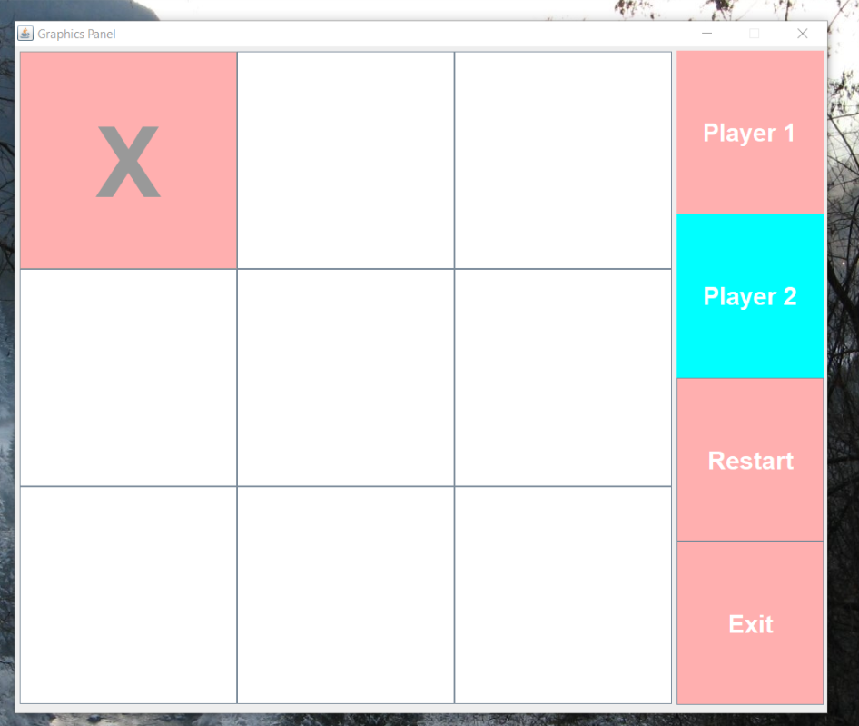
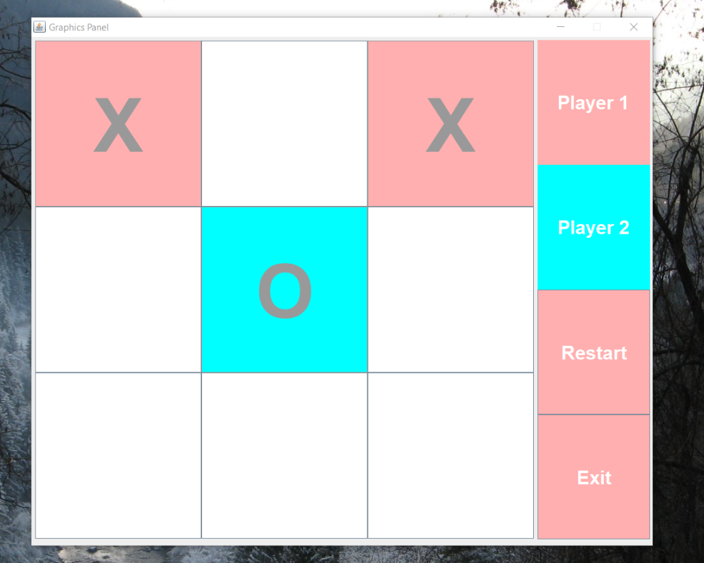

# Tic-Tac-Toe
View of game when it is first launched. Prompt for Player 1 to make it's move displayed on the right menu.

Player 1 has made its move. Prompt for Player 2 to make their move on the right menu

Player 2 makes the next move.

